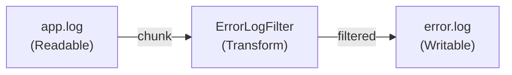
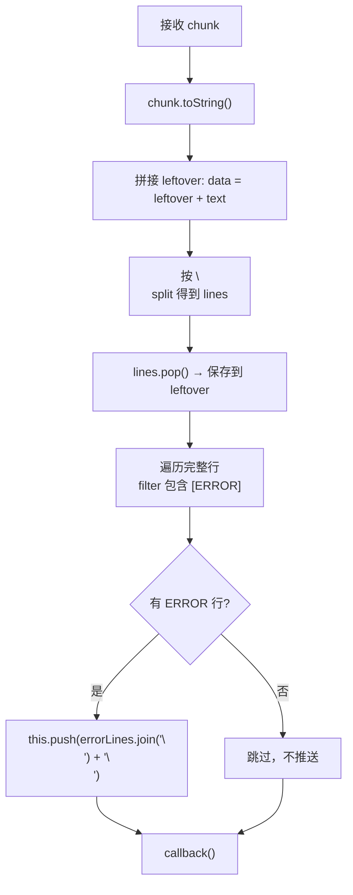
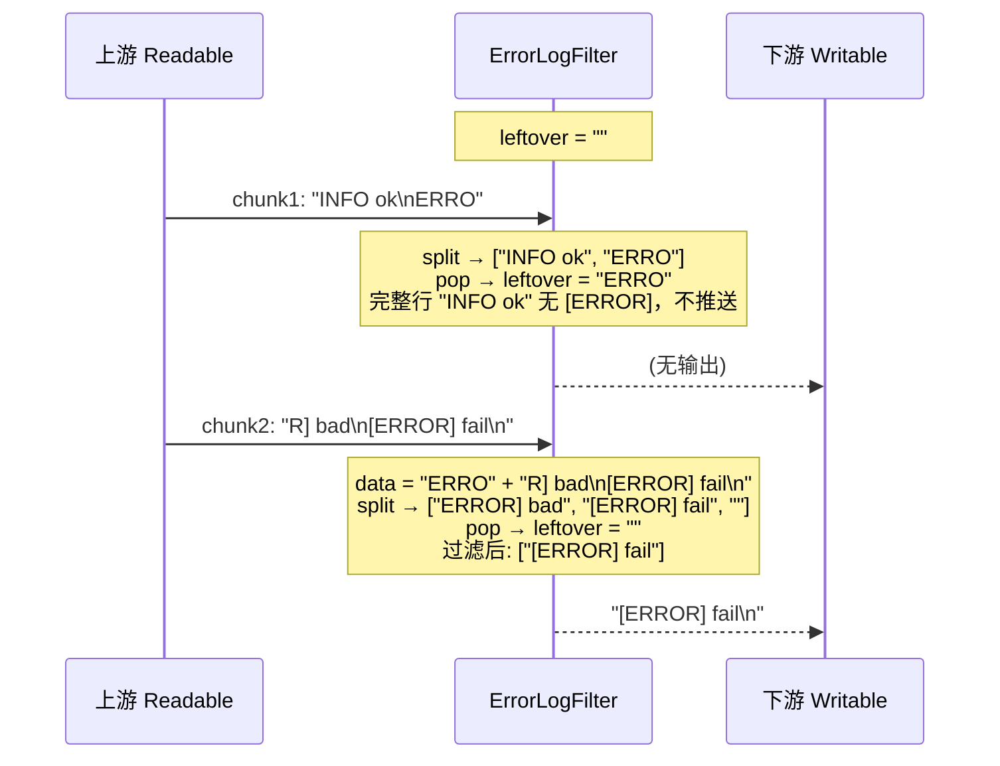
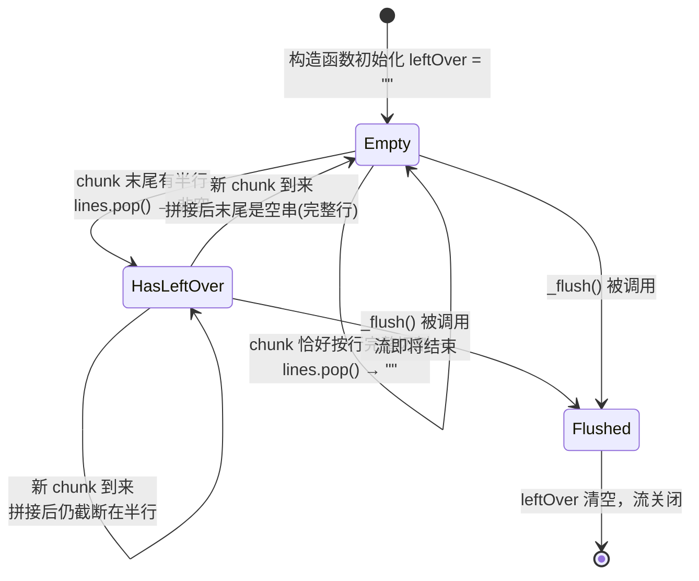

# FilterStream 实现思路

## 概述

使用 Node.js 的 `Transform` 流对日志文件进行**流式过滤**，从 `app.log` 中筛选出所有包含 `[ERROR]` 的行，写入 `error.log`。

整体采用 **Readable → Transform → Writable** 的管道模式，内存占用恒定，适合处理超大日志文件。

---

## 整体数据流



---

## 核心类 ErrorLogFilter

继承自 `Transform`，内部维护两个字段：

| 字段       | 作用                                   |
| ---------- | -------------------------------------- |
| `leftOver` | 缓存当前 chunk 末尾不完整的半行        |
| `timer`    | 预留字段（当前未使用）                 |

### _transform 处理流程

每次上游推入一个 chunk，执行以下步骤：



#### 关键设计点：leftover 机制

由于 chunk 的切割位置是随机的，一条完整日志行可能被拆成两个 chunk：



> chunk1 末尾的半行 `"ERRO"` 被 `pop()` 存入 `leftOver`，在 chunk2 到来时拼接到头部，恢复为完整行 `"ERROR] bad"`。

---

## 核心状态

整个程序只有一个**有状态**的组件——`ErrorLogFilter` 实例，其核心状态就是 `leftOver` 字段：

```
leftOver: string   // 始终为 "" 或一段不完整的日志行（不含 \n）
```

### 状态含义

| `leftOver` 值      | 含义                                             |
| ------------------- | ------------------------------------------------ |
| `""` (空字符串)     | 当前没有残留半行，上一个 chunk 恰好在行尾截断    |
| `"ERRO"` 等非空串   | 上一个 chunk 末尾有一截不完整的行，等待下次拼接  |

### 状态变化（状态机）



**状态迁移公式（每次 `_transform` 调用）：**

```
data = old_leftOver + chunk.toString()
lines = data.split('\n')
new_leftOver = lines.pop()       // 总是取走最后一个元素
```

- `lines.pop()` 可能返回 `""`（data 以 `\n` 结尾）→ 回到 Empty
- `lines.pop()` 可能返回非空串 → 进入 HasLeftOver

---

## 核心数据结构

### 1. ErrorLogFilter（Transform 流）

```
ErrorLogFilter extends Transform {
    leftOver: string       // 核心状态：跨 chunk 的半行缓存
}
```

### 2. 管道拓扑

```
pipeline(readStream, transformStream, writeStream)
         ──────────  ──────────────  ─────────────
         fs.createReadStream    ErrorLogFilter    fs.createWriteStream
         (Readable)             (Transform)       (Writable)
         对象模式: false         对象模式: false    对象模式: false
         编码: Buffer           编码: Buffer       编码: Buffer
```

### 3. 数据在 Transform 内部的变换过程

```
输入 (Buffer chunk)
  │
  ▼  chunk.toString()
字符串 text
  │
  ▼  this.leftOver + text
拼接字符串 data
  │
  ▼  data.split('\n')
字符串数组 lines ──────────► lines.pop() ──► 新 leftOver（状态迁移）
  │
  ▼  lines.filter(含 [ERROR])
过滤后数组 errorLines
  │
  ▼  errorLines.join('\n') + '\n'
输出字符串 ──► this.push() ──► 下游 Writable
```

---

## 关键设计决策

### 为什么用 `lines.pop()` 而不是判断最后一个字符？

`split('\n')` 在末尾有 `\n` 时会产生一个空串 `""`：

```js
"abc\n".split('\n')  // → ["abc", ""]
"abc".split('\n')    // → ["abc"]
```

- 末尾有 `\n` → `pop()` 返回 `""` → `leftOver = ""` → 无残留
- 末尾无 `\n` → `pop()` 返回半行 → `leftOver = "ERRO"` → 有残留

这恰好就是我们想要的行为，不需要额外的末尾字符判断。

### 为什么 `_flush` 必须存在？

流结束时，最后一个 chunk 处理完后 `leftOver` 可能仍然非空（最后一条日志行没有以 `\n` 结尾）。`_flush` 在流关闭前被调用，负责：

1. 检查残留 `leftOver` 是否含 `[ERROR]`
2. 如果是，`this.push()` 输出
3. 清空 `leftOver = ''`
4. 调用 `callback()` 通知流可以关闭

如果没有 `_flush`，日志文件最后一行（若不以 `\n` 结尾）会被**静默丢弃**。

### 为什么用 `pipeline` 而不是 `.pipe()`？

```js
// ❌ pipe: 错误不会传播，可能静默丢失
readStream.pipe(transformStream).pipe(writeStream);

// ✅ pipeline: 任何环节出错都会正确传播到 catch
await pipeline(readStream, transformStream, writeStream);
```

---

## 内存分析

| 场景                        | 内存占用                             |
| --------------------------- | ------------------------------------ |
| 正常处理（行长度 < chunk）  | O(chunk_size + leftOver) ≈ O(chunk)  |
| 极端情况（一行超长）        | leftOver 持续增长，直到遇到 `\n`     |

> **注意**：如果日志文件中存在一行极长且不含 `\n` 的内容（如 base64 数据），`leftOver` 会持续累积，导致内存膨胀。生产环境应考虑对 `leftOver` 设置上限。